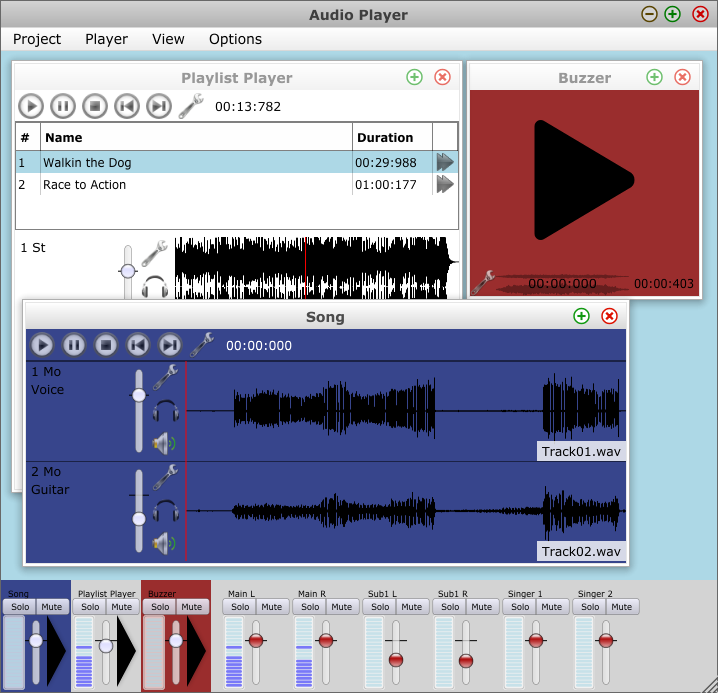

# M*Player
Multi-*channel*, multi-*track*, multi-*player* player for audio files.

## Features
* Supports basic audio file types like WAV and MP3
* Output to ASIO devices
* Freely configure output channels
* Play multi-track recordings consisting of one file per track

## Download
The latest released version can be downloaded from here:
* [MStarPlayer.exe](https://github.com/ServiusHack/MStarPlayer/releases/latest/download/MStarPlayer.exe)

## Screenshot

## Development
Pull requests are always welcome to improve the current code or add new features.

### How To Compile

1. Get [CMake](https://cmake.org/).
2. Get [Visual Studio](https://www.visualstudio.com/downloads/).
3. Clone this repository, including its submodule.
4. Call cmake like this: `cmake -S . -B build_dir`
5. Build: `cmake --build build_dir`

## License

M\*Player's own code is historically dual-licensed for ASIO support.
This makes licensing a bit complicated but keeps the flexibility that was beneficial in the past.

Component      | License
---------------|--------
Icons          | LGPL
JUCE           | see https://github.com/WeAreROLI/JUCE
M\*Player code | GPL and ISC

## Notes
Unnecessary binary data and the ASIO framework have been removed from the commit history. This means older revisions might not compile.
